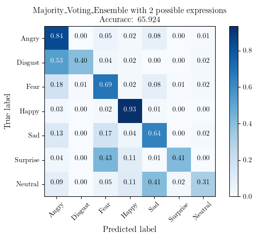
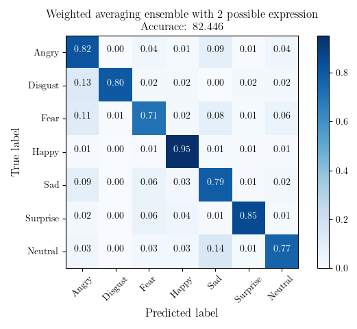

# CSC245-Fall2024-TeamAlchemists-CodeRepository

Welcome to Team Alchemists code repository!

Edit final report with [Overleaf](https://www.overleaf.com/9115683215npbpwvgrswkq#97b01b)

## Setup
Use conda environment. Download everything that is missing.

## Train
```
python train_EmoViT.py
python main_fer2013.py
```

or you can download our checkpoint [here](https://drive.google.com/drive/folders/1o494B64eHDQ4GcERecIiN0ZdIy1GkN_1?usp=sharing)


## Evaluate
```
# adjust plot output and model you want to use respectively in the file
python weighted_averaging_ensemble.py
python majority_voting_ensemble.py
```

## Experiment Result:
Qualitative Result:


Quantitative Result:

Majority Voting(Not promising)



Weighted averaging(Impresive)




