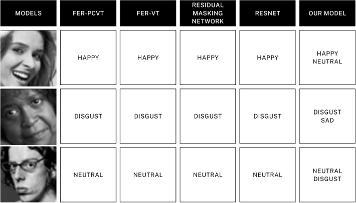
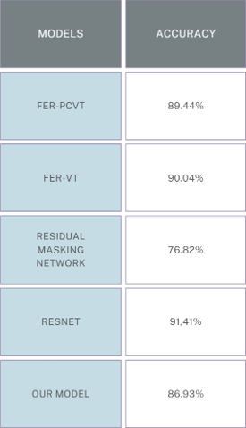
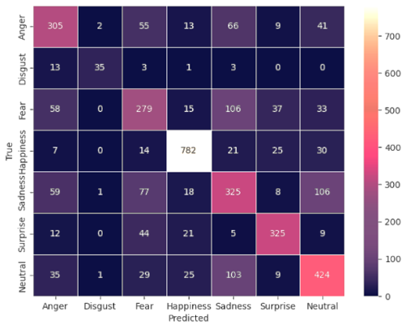

# CSC245-Fall2024-TeamAlchemists-CodeRepository

Welcome to Team Alchemists code repository!

Edit final report with [Overleaf](https://www.overleaf.com/9115683215npbpwvgrswkq#97b01b)


## Train
```
python train_EmoViT.py
python main_fer2013.py
```

## Evaluate
```
# adjust plot output and model you want to use respectively in the file
python weighted_averaging_ensemble.py
python majority_voting_ensemble.py
```

## Experiment Result:
Qualitative Result:



Quantitative Result:



Accuracy on each expression:




